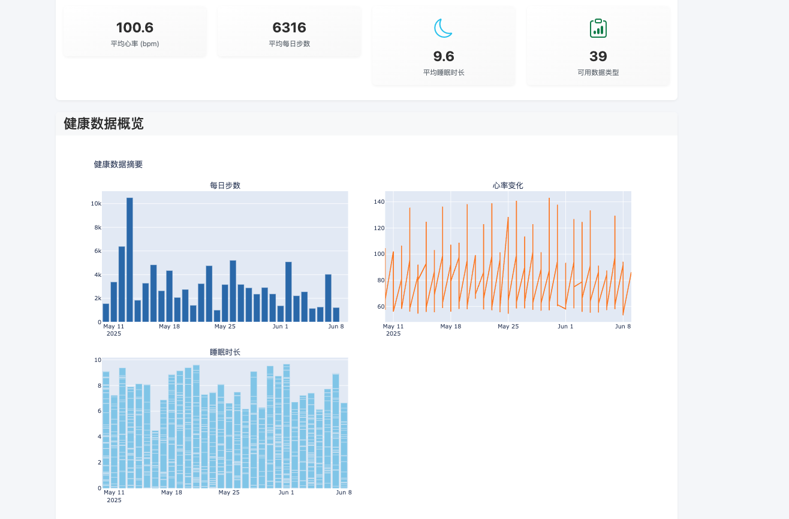

# SeeMyStats - Apple Watch 数据分析平台 / Data Analysis Platform

> **注意 / Note:**  
> 此项目不再维护，不支持英文。  
> This project is no longer maintained and does not support English.

## ✨ 核心特色 / Core Features

### 🔬 技术分析 / Technical Analysis
- **移动平均线分析 (Moving Average Analysis):** 7日、14日、30日 SMA 识别健康趋势。
- **相对强弱指数 (RSI - Relative Strength Index):** 检测健康指标的异常波动。
- **布林带分析 (Bollinger Bands):** 基于标准差识别数据异常区间。
- **平均真实范围 (ATR - Average True Range):** 量化健康数据的波动性。

### 📈 交互式可视化 / Interactive Visualization
- **框选工具 (Box Select):** 精确选择数据区间进行分析。
- **自由套索选择 (Lasso Select):** 任意形状的数据点选择。
- **多层次缩放 (Multi-level Zoom):** 从宏观趋势到微观细节的无缝缩放。

### 🧠 智能数据分析 / Data Analysis
- **多维相关性分析 (Multivariate Correlation):** 发现不同健康指标间的关联。
- **统计显著性检验 (Statistical Significance Testing):** 科学验证数据关联性。

## 🚀 功能模块 / Features

### 📊 仪表板系统 (Dashboard)
- 实时健康数据概览 / Real-time health overview
- 多指标综合展示 / Multi-metric visualization



### 📱 数据管理 (Data Management)
- Apple Health XML 数据导入 / Apple Health XML import
- 多格式数据支持 / Multi-format data support
- 数据清洗与预处理 / Data cleaning & preprocessing


## 🛠️ 技术架构 / Tech Stack

### 后端技术 / Backend
```
Flask 2.3.3
Pandas 2.0.3
NumPy 1.24.3
Matplotlib 3.7.2
Plotly 5.16.1
```

### 前端技术 / Frontend
```
Bootstrap 5
Plotly.js
JavaScript ES6+
```

### 数据处理 / Data Processing
```
XMLtoDict 0.13.0
BeautifulSoup 4.12.2
lxml 4.9.3
```


## 📦 快速开始 / Quick Start

### 环境要求 / Requirements
- Python 3.8+
- 8GB+ RAM
- 现代浏览器支持（Chrome, Firefox, Safari）

### 安装步骤 / Installation
```bash
git clone https://github.com/yourusername/healthweb.git
cd healthweb
python -m venv venv
source venv/bin/activate  # 或 venv\Scripts\activate (Windows)
pip install -r requirements.txt
python run.py
```
打开浏览器访问: http://127.0.0.1:5000

## 📋 使用指南 / Usage

数据导入流程 / Data Import Flow

在 iPhone 健康应用中导出健康数据 / Export data from Apple Health

点击“上传数据”并选择 ZIP 或 XML 文件 / Click "Upload Data" → choose ZIP/XML

等待解析并开始分析 / Wait for parsing & start analysis


📊 支持的数据类型 / Supported Data Types

生理指标 / Physiological Metrics: 心率 & 心率变异性 (Heart Rate & HRV), 体温 (Body Temperature)

活动数据 / Activity Data: 步数 & 距离 (Steps & Distance)

睡眠健康 / Sleep Health: 睡眠时长 (Sleep Duration)

📄 许可证 / License

本项目采用 MIT 许可证 (MIT License). 详情见 LICENSE。

🙏 致谢 / Acknowledgements

Apple Health 团队提供数据标准 / Apple Health Data Standards

Plotly 社区提供优秀可视化库 / Plotly team

Flask 社区支持 / Flask community

---

📌 **免责声明 / Disclaimer**  
本平台展示仅用于学习与演示目的，所有健康数据图表和分析**不构成医学建议**。  
**请勿将本系统结果作为临床诊断或治疗依据。如有健康疑虑，请咨询专业医生。**
This platform is for demonstration and educational use only. All visualizations and analytics shown do not constitute medical advice.
Please do not rely on this system for clinical decisions. Consult licensed medical professionals if you have health concerns.
